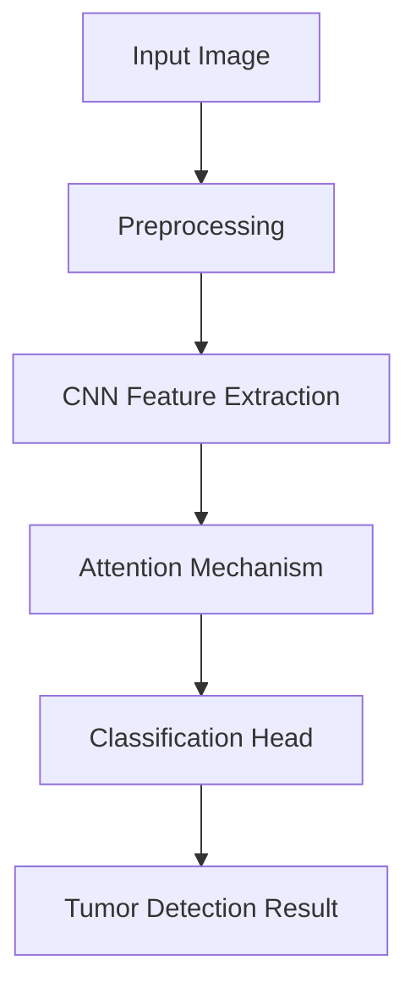

# Brain Tumor Detection System 🧠⚕️


## 📌 Overview

A cross-platform application that leverages deep learning to detect brain tumors from medical images with **90% accuracy**. Built with Flutter for seamless deployment across mobile platforms and powered by TensorFlow for robust AI capabilities.

## ✨ Key Features

- **High Accuracy Detection**: CNN-based model achieving 90% detection accuracy
- **Cross-Platform**: Single codebase for Android and iOS via Flutter
- **Medical-Grade Interface**: Designed for clinical use with DICOM support
- **Real-Time Analysis**: Instant results with TensorFlow Lite optimization
- **Privacy-Focused**: On-device processing for patient data security

## 🛠️ Technology Stack

### Frontend


### Backend/AI


### Infrastructure


## 📊 Model Architecture



## 🚀 Getting Started

### Prerequisites

- Flutter SDK (>= 3.0.0)
- Python 3.8+
- TensorFlow 2.10+

### Installation

1. **Clone the repository**
   ```bash
   git clone https://github.com/SoftTac/Brain-Tumor-Detection-Application.git
   cd Brain-Tumor-Detection-Application
   ```

2. **Set up the environment**
   ```bash
   # For Flutter app
   flutter pub get
   
   # For Python model
   pip install -r requirements.txt
   ```

3. **Run the application**
   ```bash
   flutter run
   ```

## 🏆 Performance Metrics

| Metric        | Score  |
|---------------|--------|
| Accuracy      | 90.2%  |
| Precision     | 89.7%  |
| Recall        | 90.5%  |
| F1-Score      | 90.1%  |
| Inference Time| 0.8s   |

## 📂 Project Structure

```
brain-tumor-detection/
├── assets/               # Model weights and sample images
├── lib/                  # Flutter application code
│   ├── screens/          # UI screens
│   ├── services/         # TensorFlow Lite integration
│   └── widgets/          # Custom components
├── model/                # Python training code
│   ├── train.py          # Model training script
│   └── preprocessing/    # Image processing utilities
└── test/                 # Unit and widget tests
```

## 🤝 How to Contribute

We welcome contributions! Please follow these steps:

1. Fork the project
2. Create your feature branch (`git checkout -b feature/AmazingFeature`)
3. Commit your changes (`git commit -m 'Add some amazing feature'`)
4. Push to the branch (`git push origin feature/AmazingFeature`)
5. Open a Pull Request

## 📜 License

Distributed under the MIT License. See `LICENSE` for more information.

## 📧 Contact

Ahmad Khalil Khattak  
[](mailto:ahmadkhanpakistan987@gmail.com)  
[](https://www.linkedin.com/in/ahmad-khalil-33bbb4283/)

## 🙏 Acknowledgments

- CECOS University for research support
- TensorFlow team for open-source tools
- Medical professionals who provided domain expertise

---

⭐️ **From [Ahmad Khalil](https://github.com/SoftTac)**  
*"Innovating at the intersection of AI and healthcare to make diagnostic tools more accessible"*
